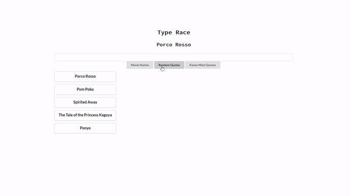

# Type Race
A React web page that tracks how long it takes the user to type a selected text snippet. The user can choose between snippets of three categories: movie titles, random quotes, and quotes from Kanye West. The app randomly selects three snippets for each category subsequently allowing the user to receive a new batch upon refreshing the web page.

# Technologies Used
* React
* JavaScript
* HTML/CSS
* Semantic UI

# Screenshots

## Typing a Kanye West snippet (animated)

## Default view

## After selecting Kanye West quotes

## Choosing a specific Kanye West snippet

## After typing the snippet and receiving a time
