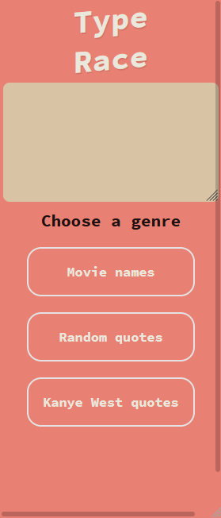
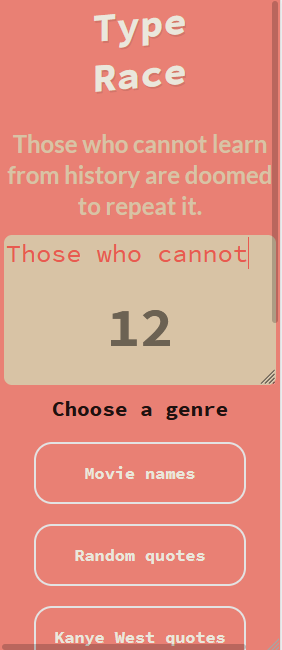
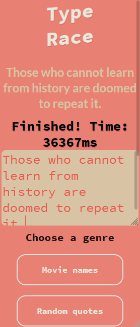
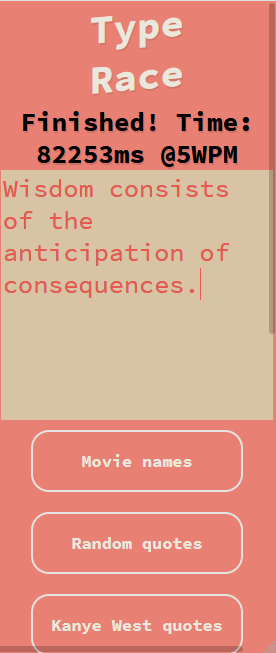
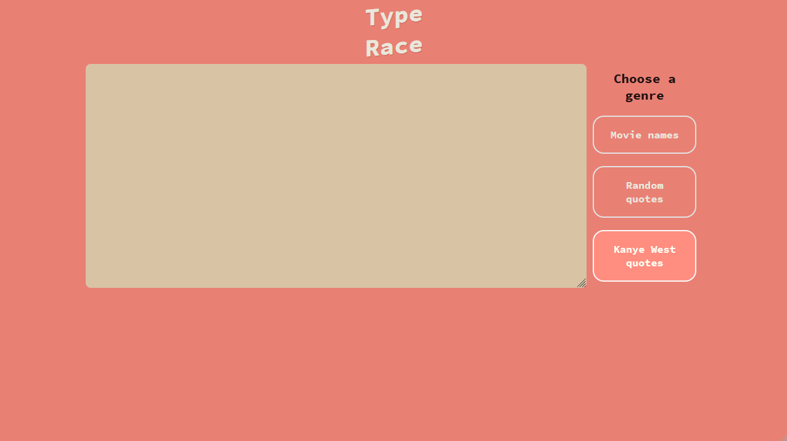
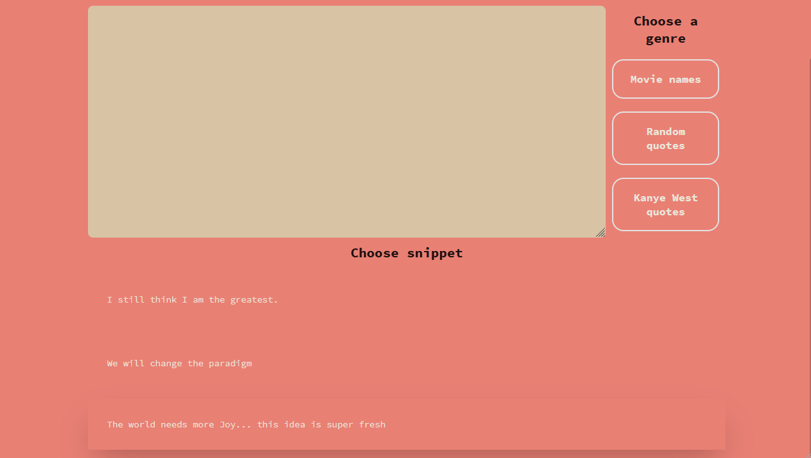
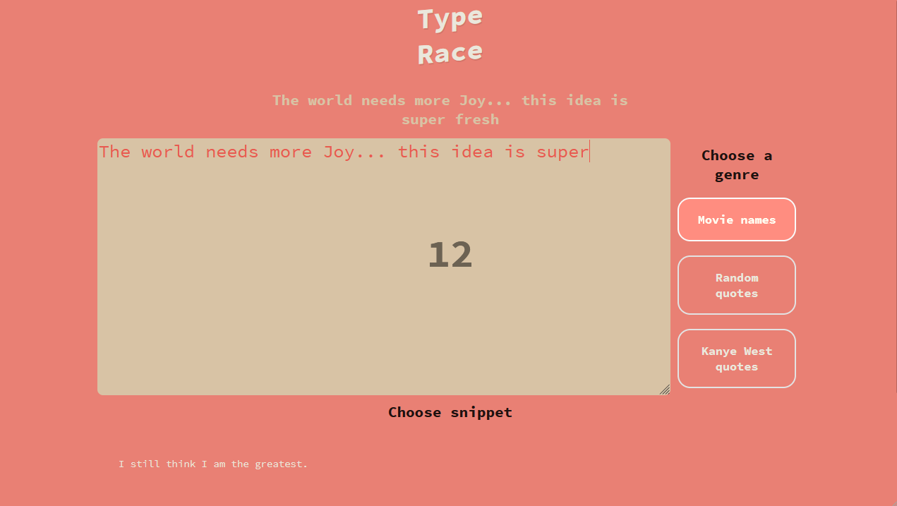
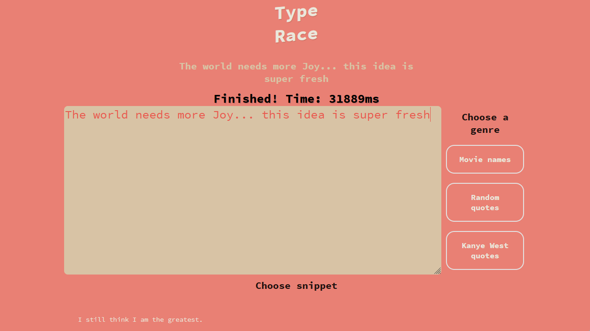
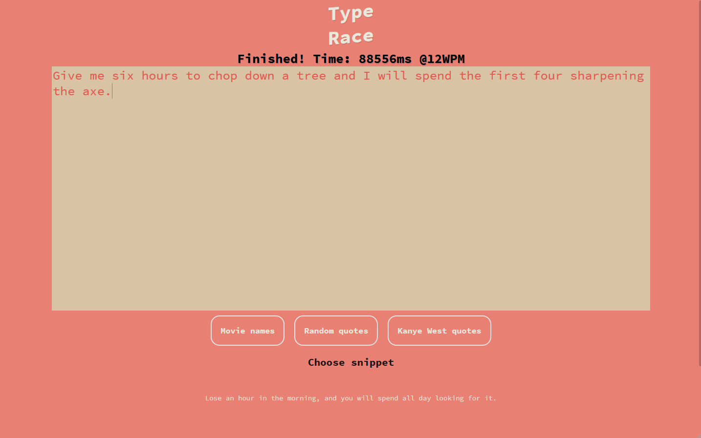

# Type Race
A web page that tracks how long it takes the user to type a selected text snippet. 

The application attempts to retrieve each text snippet dynamically via REST API request(s). The application will use static data upon failure to retrieve data from corresponding GET request.

### Technologies Used
* React.js
* TypeScript
* HTML5
* CSS3
* Vite
* TanStack / React Query
* ESLint
* Prettier
* VS Code
* AWS Amplify

### Data sources / credits
- Source of quotes (deprecated): https://api.quotable.io/random
- Source of fallback quotes: https://type.fit/api/quotes

### Future improvements
- Update screenshots
- Fixed bug where timer does display upon deleting completed text
- Write some unit tests

# Screenshots

## Default view (Galaxy Fold emulation)

## After selecting random quotes as genre, application automatically scrolls down (Galaxy Fold emulation)

## After choosing a random snippet and beginning type race (Galaxy Fold emulation)

## Mid game. Typed characters (pink) overlay selected snippet (grey) - (Galaxy Fold emulation)

## After completing type race. Displays time in milliseconds and words per minute (Galaxy Fold emulation)

## Default view (Desktop)

## After selecting random quote genre. Automatically scrolls down (Desktop)

## After selecting a random quote and starting type race (Desktop)

## Mid game. Typed characters (pink) overlay selected snippet (grey) - (Desktop)

## After completing type race. Displays time in milliseconds and words per minute (Desktop)

