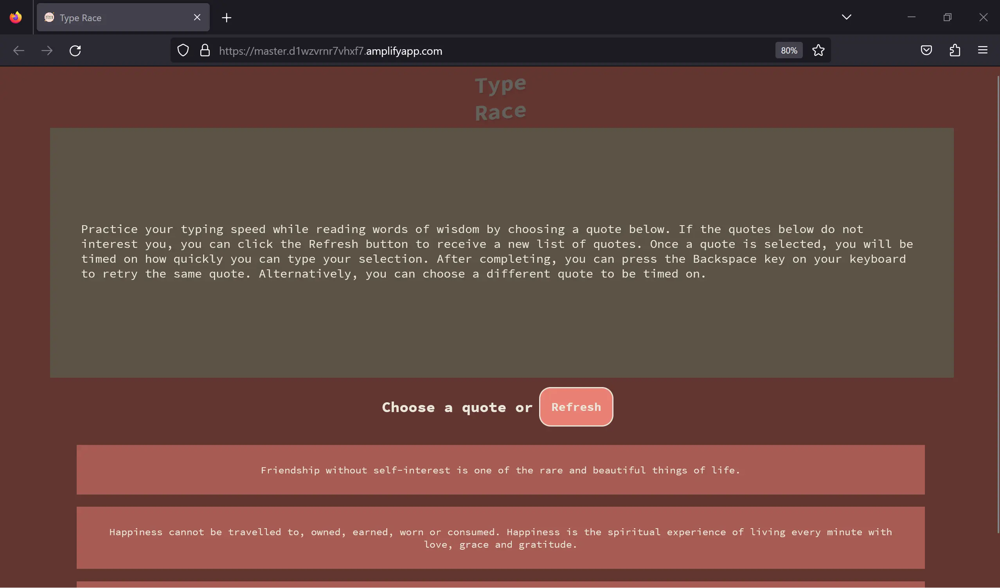

# Type Race

Practice your typing speed while reading words of wisdom.

[View the application](https://master.d1wzvrnr7vhxf7.amplifyapp.com/)

The application attempts to retrieve each quote dynamically via HTTP request(s). The application will use static data upon failure.

## Table of contents
- [Technologies used](#technologies-used)
- [Data sources](#data-sources)
- [Screenshots](#screenshots)
  - [Desktop](#desktop)
  - [Mobile](#mobile)

## Technologies Used

-   React.js
-   TypeScript
-   HTML5
-   CSS3
-   Vite
-   TanStack / React Query
-   Zod
-   ESLint
-   Prettier
-   VS Code

## Data sources

-   Source of quotes (deprecated): https://api.quotable.io/random
-   Source of fallback quotes: https://type.fit/api/quotes

# Screenshots

## Desktop

### Initial view (Desktop)

### After starting game (Desktop)

### Progress in game (Desktop)

### After game completed (Desktop)

## Mobile

### Initial screen (Mobile)

### Initial screen 2 (Mobile)

### Progress in game (Mobile)

### Game completed (Mobile)

